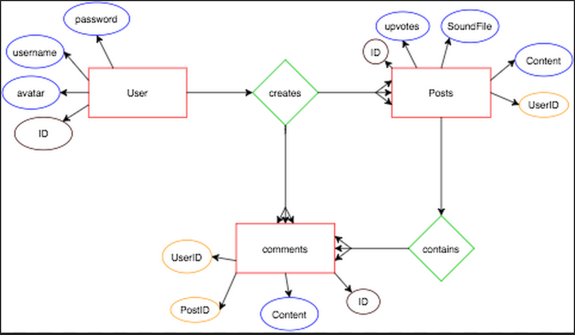

#README - Static-Address

###Project Info

Static-Address is a exciting new music forum. The website features customized integration with Soundcloud and Youtube media players. It's easy to create a new post too! All you need to do is create an account, fill out a basic form, supply a link to the Soundcloud or Youtube file you want to attach to your post, and voilá! You have a new post with your song attached. Users can comment and (hopefully) upvote on your post to drive its popularity.

###Members 
Raina Koren | Matt Fewer | Anthony Lui | Steven Edelmann

###Technologies Used
*	Ruby on Rails
*	Lots of Javascript
*	jQuery
*	Postgres
*	Foundation
*	Soundcloud SDK
*	Soundcloud Media Player
*	Youtube Media Player
*	**Not** Turbolinks

[Link to Trello]('https://trello.com/b/VY6ABgmU/static-address' "Click Here!")  

###User Stories
1. Home Page 
* User can see SA logo, a short description of what we do, a navigation bar, followed by the list of threads. On the threads, users can see the title , amount of comments, upvotes, _some_ content. If the user is not signed in, they will not be able to post, comment, or upvote.
* New User Sign-Up
* At login page, user can either login or sign up.
* After clicking signup, user is brought to new page where they will enter their username (which must be unique), their name, password, and attach a user avatar(using _Paperclip_).
* After submitting, the server will run a check to make sure the info validates correctly.
* After validation, user is brought to home page where they can now make new posts, upvote and comment. 
* Individual Thread Page
* User  can upvote, read the content, listen to the attached music file, and comment.
* Music Functionality - user can play the sound attachment on each thread. **Start, Pause, Volume Control**. That's about it.
*. Making a New Post
a. User click on a link in the nav bar to **"Make a New Post"**
* User is brought to a new page where they are asked to input **Title, Content, and use a Soundcloud/Youtube API to link a soundfile** which will be attached to the post.
* User clicks submit, and they are brought to their brand new post which an attached soundfile.

#####Front-End Wireframe
######Welcome Page

######Show Page

#####Database Design / ERD

